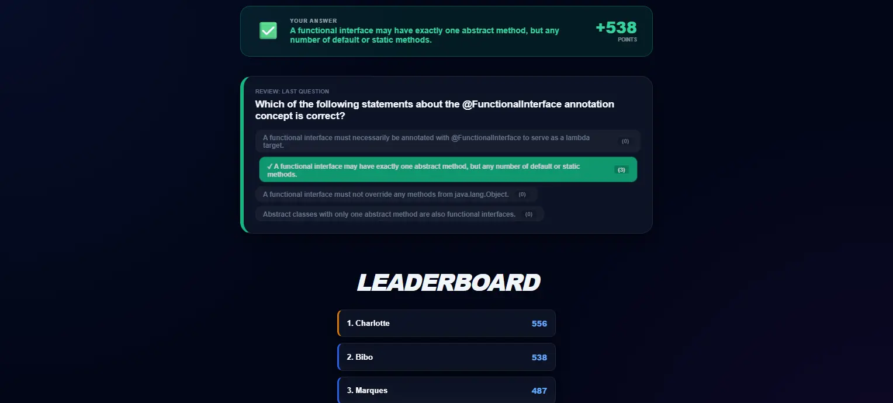

# LiteQuiz

An efficient, lightweight feedback tool for the educational sector that enables instructors to start interactive quiz sessions instantly without registration or complex infrastructure. 

The application utilizes peer-to-peer technology for real-time data exchange and validates quiz content directly during upload from simple Markdown files to guarantee a smooth process. Participants join effortlessly via QR code or direct link. The application is fully localized and available in both English and German.

[Live Demo](https://nicohartmann.dev/LiteQuiz_en.html)




## What is LiteQuiz?

LiteQuiz serves as a prime example of modern web architectures, impressively illustrating how peer-to-peer communication and client-side data processing can entirely replace traditional server-side logic. 

In educational settings, it allows students to engage in a playful knowledge check while gaining insight into handling structured data formats like Markdown and their transformation into interactive interfaces. Its combination of automatic room generation and real-time synchronization makes it an ideal case study for advanced web programming and UX design.


## Features

* **Instant Sessions:** No registration or account creation required for instructors or participants.
* **Markdown Integration:** Upload quiz questions using simple, structured Markdown files with instant client-side validation.
* **Easy Joining:** Participants can jump into the game instantly via a generated QR code or a direct link.
* **Instructor Dashboard:** Full control over game progress with a live monitor, automatic leaderboards, and a detailed review phase after each question.
* **Serverless Architecture:** Real-time data exchange handled directly via peer-to-peer communication.


## Tech Stack

* **HTML5 & CSS3:** For a responsive, clean UX design tailored for both desktop instructors and mobile participants.
* **JavaScript:** For core quiz state management, room synchronization, and parsing Markdown data.
* **WebRTC:** For robust, serverless peer-to-peer data exchange between the instructor and participants.


## Getting Started

To run this project locally, follow these simple steps:

### 1. Clone the Repository
```bash
git clone [https://github.com/kt-NicoHartmann/LiteQuiz.git](https://github.com/kt-NicoHartmann/LiteQuiz.git)
```

2. Open the Project

Navigate into the project directory and open the index.html file in your preferred web browser.
```bash
cd LiteQuiz
# On macOS/Linux:
open LiteQuiz_en.html
# On Windows:
start LiteQuiz_en.html
```

Alternatively, you can use an extension like Live Server in VS Code to host it locally.

⚠️ Important Note on WebRTC Configuration:
> The project is pre-configured to use custom STUN and TURN servers hosted at nicohartmann.dev. Because these servers are locked to specific domains/credentials for security, they will not work out-of-the-box in your local cloning environment. If you want to test the peer-to-peer features locally across different networks, you will need to replace the WebRTC configuration with your own STUN/TURN server credentials or use public defaults (like Google's public STUN servers) in the source code.

## Credits & Licenses

This project includes third-party open-source software and assets bundled within the repository:

- [PeerJS](https://github.com/peers/peerjs) – MIT License
- [Canvas-Confetti](https://github.com/catdad/canvas-confetti) – Apache 2.0 License
- [QRCode.js](https://github.com/davidshimjs/qrcodejs) – MIT License
- [Outfit Font](https://fonts.google.com/specimen/Outfit?preview.script=Latn) – SIL Open Font License (OFL)